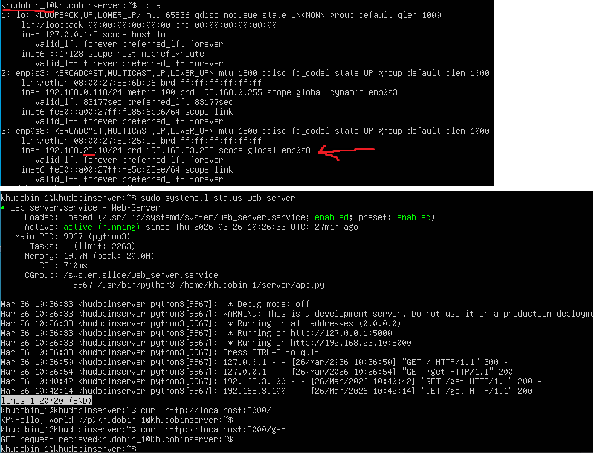
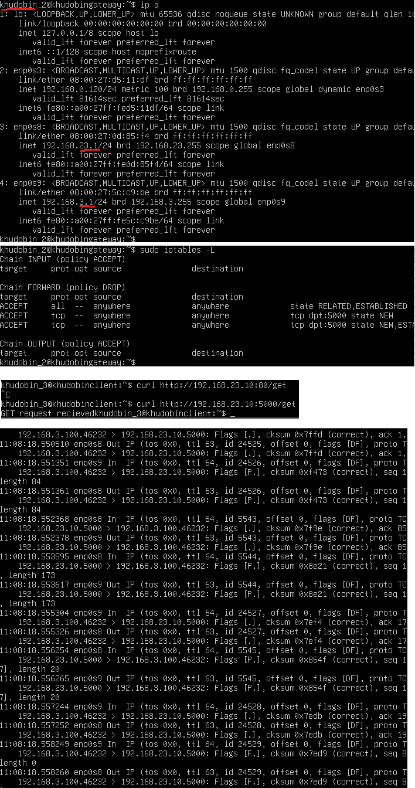
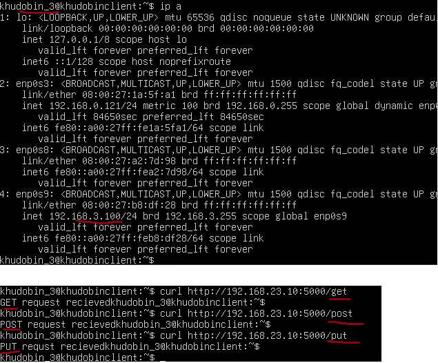

# Отчёт по лабораторной работе: Настройка сети между виртуальными машинами

## Цель работы
Настроить связь между 3мя виртуальными машинами с маршрутизацией через шлюз B и развернуть веб-сервер

## Для выполнения данного задания было реализовано:
1.	Развернуты три виртуальные машины Linux
2.	Linux A
    1. Сконфигурирован Hostname следующим образом: khudobinserver
    2. Создан пользователь khudobin_1 
    3. Сконфигурирован виртуальный интерфейс со следующим ip адресом: 192.168.23.10/24
    4. Развернут Http сервер на виртуальной машине на порту 5000. Реализованы три эндпоинта (запрос /get, /post, /put)
  


3.	Linux B
    1. Сконфигурирован Hostname следующим образом: khudobingateway 
    2. Создать пользователя <your_surname>_2 (пропустить если делаете через Play with docker)
    3. Сконфигурированы 2 виртуальных интерфейса со следующими ip адресом: 192.168.23.1/24,  192.168.3.1/24
    4. С помощью утилит ip route и iptables настроен маршрут пакетов от Linux A до C. Запрещены все пакеты, кроме http пакетов через порт 5000 
    5. Запущена программа tcpdump с фильтрацией по портам 5000



4.	Linux C
    1. Сконфигурирован Hostname следующим образом: khudobinclient
    2. Создан пользователя khudobin_3
    3. Сконфигурирован виртуальный интерфейс со следующим ip адресом: 192.168.3.100/24
    4. С помощью команды curl на машине C были посланы 3 запроса на машину А в http сервер (/get, /post, /put)
  


5. При перезагрузки системы все сервисы и сетевая архитектура функционируют также

    Разрешен переброс пакетов ip в нашем gateway
```shell
echo 1 | sudo tee /proc/sys/net/ipv4/ip_forward 1

 nano /etc/sysctl.conf # добавлена 1 в файл для автозагрузки
```
Были настроены и сохранены правила iptables
    
```shell
sudo apt-get install iptables-persistent
sudo iptables-save > /etc/iptables/rules.v4
sudo ip6tables-save > /etc/iptables/rules.v6
```
   
